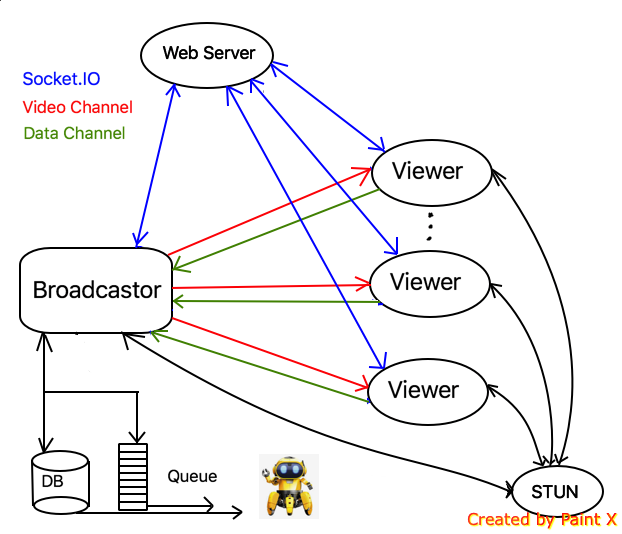

#Implement P2P Video Communication with WebRTC

## SUMMARY
> ### What is WebRTC?
> ### Development Environment
> ### Schematic diagram about high level idea
> ### Source code structure
> ### Main functions in this Apps
> ### How to use this Apps
> ### How to use "Auto Test" function

## What is WebRTC?
WebRTC is an open source project to enable realtime communication (Peer to Peer UDP) of audio, video and data in Web and native apps. Users can access these Web applications directly with the mainstream browsers such as Chrome, Firefox.

Good tutorial is [**here**](https://codelabs.developers.google.com/codelabs/webrtc-web/#0).

Source code and demo are [**here**](https://github.com/bingsyslab/WebRTC_Communication).

There are four most important part about WebRTC:

+ [**getUserMedia()**](https://webrtc.github.io/samples/src/content/getusermedia/gum/): capture audio and video from local PC. Good source [**here**](https://addpipe.com/blog/getusermedia-video-constraints/)  **\*\*\***
+ [**MediaRecorder**](https://webrtc.github.io/samples/src/content/getusermedia/record/): record audio and video. 
+ [**RTCPeerConnection**](https://webrtc.github.io/samples/src/content/peerconnection/pc1/): stream audio and video between users. **\*\*\***
+ [**RTCDataChannel**](https://webrtc.github.io/samples/src/content/datachannel/basic/): stream data between users.**\*\*\***

Note: "**\*\*\***" means heavily used in our project.

## Development Environment
**Type:** Pure Front End

**Language:** JavaScript, HTML, CSS

**Web Server:** Linux (centOS), Node.js

**Public Server:** Google STUN Server

**Other:** Socket.IO, Peer.js

## Schematic diagram about high level idea

### Key Conception
+ **Broadcaster:** Robot side, take the 360 live video stream. As a broadcaster, it will pass the video stream to multi-viewers and receive data feedback from viewers.
+ **Viewer:** User side application, it will receive video from broadcaster side and send data to the broadcaster. Multi-Viewers are supported.
+ **Web Server:** In this project, neither broadcaster nor viewer side need to run any server program. The web server is just set on some third party VPN ([**current VPN**](https://coolala.xyz) is my private one), both broadcaster and viewer can just access the web server to grab broadcaster/viewer side code(.js/.html/.css). Another function run on web server is socket.io, it is using for swaping signaling data between broadcaster and viewers.
+ **STUN Server:** WebRTC is designed to work peer-to-peer, so users can connect by the most direct route possible. Before peer-to-peer work, users should use STUN server to get their own IP address. In this project, Google STUN server is used. In another word, STUN servers are used by both clients to determine their IP address as visible by the global Internet. If both the peers are behind the same NAT , STUN settings are not needed since they are anyways reachable form each other . STUN effectively comes into play when the peers are on different networks. 
+ **Socket.IO:** It is a JavaScript library for realtime web applications. It enables realtime, bi-directional communication between web clients and servers. It has two parts: a client-side library that runs in the browser, and a server-side library for Node.js. Both components have a nearly identical API. Like Node.js, it is event-driven. **Socket.IO is using for Singling in our project**.
+ **PeerJS:** It wraps the browser's WebRTC implementation to provide a complete, configurable, and easy-to-use peer-to-peer connection API. Equipped with nothing but an ID, a peer can create a P2P data or media stream connection to a remote peer.
+ **Signaling:** It is the process of coordinating communication. In order for a WebRTC application to set up a 'call', broadcaster and viewer need to exchange information such IP address, media metadata (codecs settings, bandwitdth...), key data for secure connections etc. **Singling is implemented by Socket.IO in our project**.
+ **TURN Server:** TURN servers to function as relay servers in case peer-to-peer communication fails. **TURN server is not used in our project**.
+ **Peer to Peer data:** Using UDP protocal.

+ **Singling Data:** Using STUN protocal.

## Source code structure
### Server side
+ **server.js:** Contains two functions. First one is https service(express.js); another one is server side signaling function(socket IO).

### Common part
+ **index.html:** home page of this Apps (https://coolala.xyz)
+ **view.js:** global configuration, such as socket io, stun server setting.
+ **credentials.js:** https credentials code
+ **certificate/ca.cer, csr.pem, private.pem:** https credentials

### broadcaster side
+ **broadcast.html:** broadcaster side webpage layout.
+ **broadcast.js:** implement all the functions on broadcaster webpage(except database CRUD and data channel).
+ **indexedDBFunction.js:** NoSQL database CRUD API **receiveDemo.js:** implement receive function of data channel with database API and Queue. 
+ **writeFile.js:** download function
+ **FileSaver.js:** download function

### viewer side 
+ **watch.html:** viewer side(no rendering) webpage layout.
+ **watch.js:** implement basic video display(no rendering) function.
+ **watch-360.html:** viewer side(with rendering) webpage layout.
+ **watch-360.js:** implement video display(with rendering) function.
+ **three.js:** required file rendering function
+ **sendDemo.js:** implement sender API of data channel.
+ **DeviceOrientationControls.js:** viewer(laptop/mobile) side orientation controller.
+ **CSS3DRenderer.js:** required file rendering function

## Main functions in this Apps
### Peer to Peer Video Channel(Socket IO)
The flow of creating a webRTC data channel is easy, but the webRTC API is not easy to use. About the flow, please check official [**tutorial**](https://codelabs.developers.google.com/codelabs/webrtc-web/#0). The most important part is signaling. Here we use Socket.IO to implement signaling. The key idea about socket.IO is how to send data from one peer to another.

In VPS(node.js), we run server part of socket.io. In peer(in our case, it is browser), we run client part of socket.io. Once we want to send data from peer1 to peer2, data is sent to VPS first, then sent to peer2.

server (Eg. server.js):

	io.sockets.on('connection', function (socket) {
		socket.on('candidate', function (id, message) {
    		socket.to(id).emit('candidate', id, message);
    	});
	}
    
peer1 (Eg. broadcast.js):

	socket.emit('candidate', id, message);

peer2 (Eg. watch.js):
	
	socket.on('candidate', function(id, candidate) {
		console.log('id and candidate info :' + id + " ::: " + candidate);
	});

Initialization of socket IO, please check official turtual and case in our project.

### Peer to Peer Data Channel(Peerjs)
Just like I mentioned before, the flow/logic of creating webRTC data/video channel is easy, but the original API of webRTC is hard to use. Using Peerjs, it is easy to implement a channel. Let's say there are two peers, peerA and peerB. We want to create a data channel between these two peers. There are only two step we need to do. One is using socket IO to send peerA's peer id to peerB. Then, using Peerjs API to create data channel. Done!

peerA (establish data channel, eg. receiveDemo.js):
	
	let peer = new Peer();
	peer.on('open', function(){
		socket.emit('set_broadcast_id');
		socket.on('request_broadcast_id', function(data){
			socket.emit('peerId_test', peer.id, '/#'+data);
		});
	});

peerB (establish data channel, eg. sendDemo.js):

	let peer = new Peer();
	let conn = null;
	
	setTimeout(function(){
		localPeerId = socket.id;
		socket.emit('request_broadcast_id', socket.id);
	}, 1000); // 1s delay is trick. Timing consideration.
	
	socket.on('peerId_test', function(data) {
      conn = peer.connect(data);
      conn.on('open', () => {
      	console.log("Data channel ready!");
      });
	});
	
PeerA (receive data, receiveDemo.js):
	
	peer.on('connection', (conn) => {
		conn.on('data', (data) => {
			let obj = JSON.parse(data);
    	}
    });

PeerB (send data, eg. watch-360.js):

	conn.send(JSON.stringify(obj));

###IndexedDB CRUD
DB API is defined in indexedDBFunction.js. In order to save data into DB fast, no index is used. Auto increased primary key is used, but PK is transparent for user. We don't care the value of primary key, it is only used for create database. There are two kind of data structure in this DB. 

DB API contains:

	async function indexedDBRead(tableName, keyValue);
	async function indexedDBReadAll(tableName);
	async function indexedDBAdd(tableName, obj);
	async function indexedDBRemove(tableName, keyValue);
	async function indexedDBRemoveAll(tableName);
	async function indexedDBDownload(tableName); 
Note: We don't use DB API in the current project, because we found the way we use this DB is more close to the way we use a Array structure.
But we can still use this DB API in the future :)

data from laptop: 

	{"time":1559000238943,"yaw":1.5707963267948966,"pitch":0,"peerId":"VOFinmCHcEyIchYiAAAT"}
	
data from mobile:

	{"time":1559000093327,"quaternion":[0.24739492670010083,0.5768548100699484,0.33931113047541106,-0.7006441572422577],"peerId":"G3JreKiPzsO8y53iAAAR"}
	
### Buffer Queue
In receiveDemo.js, we implement a FIFO queue. Consider the robot have a relative low read-queue rate but viewers have a higher write-queue rate, we design below queue API.

Queue API:
	
	function Queue(){
		this.data = [];
	}
	
	Queue.prototype.addItem = function(record){		this.data.unshift(record);
	}

	Queue.prototype.getItem = function(){
		return this.data.pop();
	}
	
	Queue.prototype.checkFirstItem = function(){
		return this.data[0];
	}

	Queue.prototype.size = function(){
		return this.data.length;
	}

	const q = new Queue();
	
Using this queue with a limited size, we can block the addItem function if the queue size reach the limition. In this way, we can make sure the robot can read the relative new data from the queue.

### Download 

html file (eg. broadcast.html):
	
	
	
javascript file (eg. indexedDBFunction.js):
	
	let buffer1 = new Blob([largeArr_laptop], {type: "text/plain;charset=utf-8"});
    saveAs(buffer1, "laptopData.txt");
    

### Rendering 
Not my part.

## How to use this Apps

####Step 1:

Open boradcaster webpage first.

Then turn on the video. (Different devices have different camera performance, select supported resolution)

####Step 2:

Open viewer webpage. (Support multi-users).
The viewer button leads to the default viewer webpage (simply display the vedio without rendering, no data feedback)

Now, data channel can be established automatically.
Once data channel is ready, you will see some information appears in Chrome debug tool (console tag).

####Step 3:

If you want to play with the viewer with rendering and data feedback,
it is necessary to modify the viewer side url to:
	
	https://coolala.xyz/watch-360.html
	
Once you refresh the new webpage, you will see the same information appears in Chrome debug tool (just like Step 2).

Now, you can play with your device, dragging the video or moving the smartphone, related data are sending back from viewers to broadcaster constantly.

If you want to stop the viewer side, the best way is close the current viewer webpage.

####Step 4:

If you want to download the related data which the viewers send back, please click the download button. Follow the hint to select the correct data you want to download. We only support two kind of data now, "laptop" or "mobile". Make sure your enter is correct.

####Step 5:

Once download finished, some information can be seen in the broadcaster side console tag. 

####Step 6:

Got the data, done!

###Note:
1. In this project, we don't use DB now. The download data is from an array.
2. After clicking the download button, all the data will be lost after download.
3. Once reloading the broadcaster side webpage, all the data will be lost, no matter you click the download button or not.
4. It is the first version of this document, not the final one. I will keep improving it. (I am sure some typo in it...)

## How to use "Auto Test" function

There are only two buttons related to "Auto Test".

####Step 1: 

Click "Broadcaster-Auto Test" button, broadcaster page will be opened with 4K 3840*1920 streaming video automatically.

####Step 2:
Click "Viewer-shader-BL-Auto Test" button, viewer page will be opened.

Viewer side has three functions:

A. Viewer side can send test data back to broadcaster side after the "start signal".

B. Viewer side can detect the "start signal": when "black screen" disappears, viewer side start to send test data back.

C. Test data can be configured through [**github page**](https://www.shuoqianwang.com/data.txt). The file path can be set in ***watch-shader-test-BL-test.js***.

